####Типовой расчет по теме _"Тригонометрические ряды Фурье"_
`11 вариант`

Подготовил : **Ившин Андрей М3134**

Все предоставленные материалы можно проверить в прикрепленной программе `main.py`.

1. График _данной функции_ :
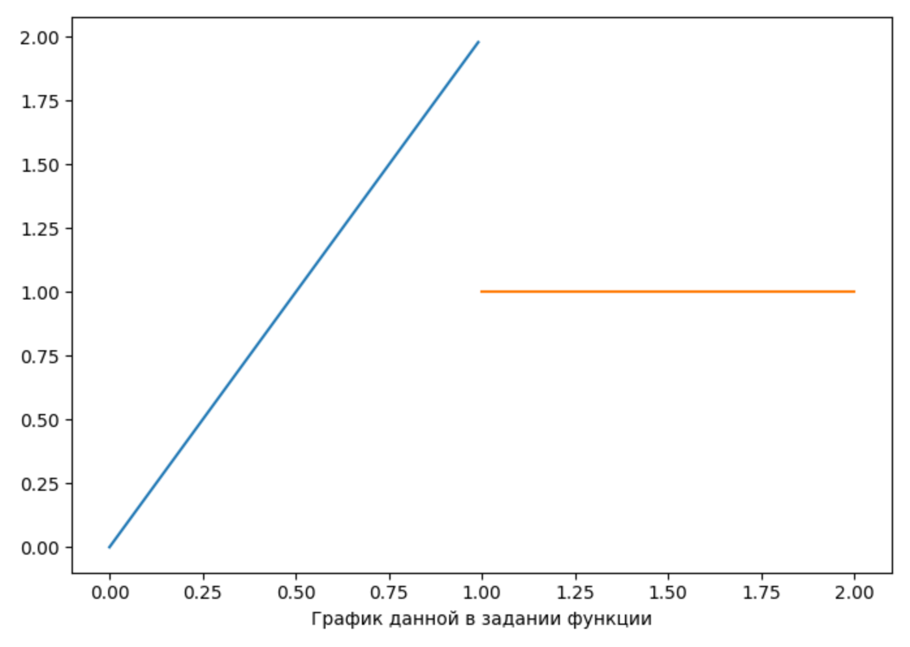
2. График _тригонометрического ряда Фурье_ :
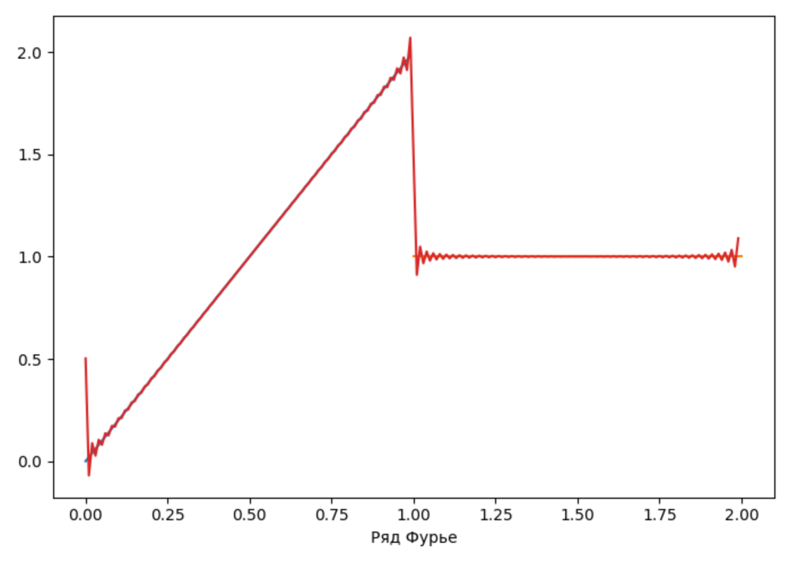
3. График _ряда Фурье по синусам_ :

4. График _ряда Фурье по косинусам_ :

В приведенных выше графиках использовалась _частичная сумма_ 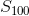,
для того, что бы _изменить_ ее - введите желаемое вами число в константу `N`, в прикрепленной программе
(строка 7).

#####Формулы, которые были использованы :
1. Формула данной в задании _функции_  
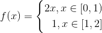

2. Формулы для нахождения _тригонометрического ряда Фурье_   
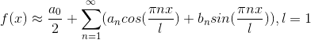
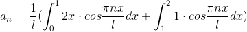
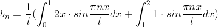

3. Формулы для нахождения _ряда Фурье по синусам_   
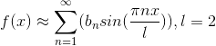
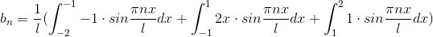

4. Формулы для нахождения _ряда Фурье по косинусам_   
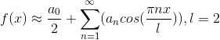
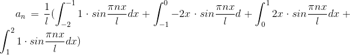

_latex визуализация_ сделана при помощи сайта [codecogs](https://www.codecogs.com/latex/eqneditor.php)